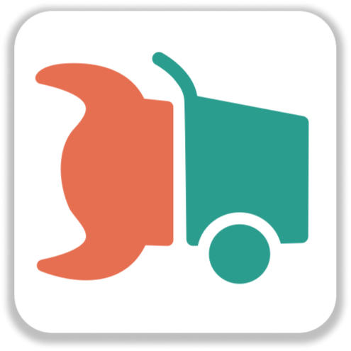

<div align="center">
    
    <h1>CargoRocket App</h1>
</div>

<div align="center">
  
</div>

<div align="center">
  <a href="https://play.google.com/store/apps/details?id=de.cargorocket">
    
  </a>
</div>

The CargoRocket app will be available for IOS and Android soon. 
This application acts as demo for the [CargoRocket Routing](https://github.com/CargoRocket/CargoHopper) based on [Graphhopper Routing Engine](https://www.graphhopper.com/) and our [CargoBikeIndex](https://cargorocket.de/cargobikeindex#7.5/48.656/9.491).

## Development

This Application is build using [React Native](https://reactnative.dev/), [UI Kitten Framework](https://github.com/akveo/react-native-ui-kitten), [Native Mapbox GL](https://github.com/react-native-mapbox-gl/maps), [MMKV Storage](https://github.com/ammarahm-ed/react-native-mmkv-storage), besides other dependencies.

It follows a modern and simplified React functional components code-style.

```sh
# Download, install and auto-link dependencies
$ yarn

# Start metro bundle server
$ yarn start

# Start Android build
$ yarn android

# Start IOS build
$ yarn ios
```


## Contribute

Please follow our [Contribution Guidelines](./CONTRIBUTE.md)